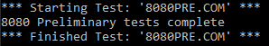
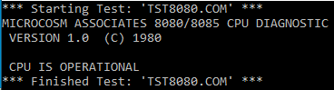
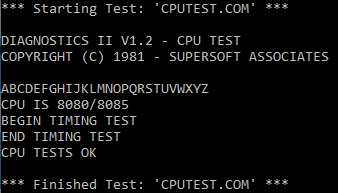
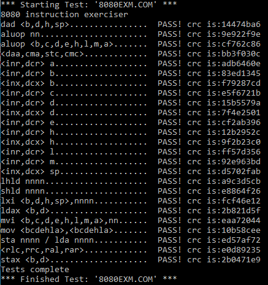

# Intel 8080
Written in C++20, this emulator emulates every aspect of the Intel 8080 processor, this chip was the brains behind many arcade games back in the day and it was most notably used in one of the highest grossing and most influential video games of all time: 
Space Invaders

### Test ROM results
The emulator passes the following tests:
- [x] 8080PRE.COM 
- Preliminary test for 8080/8085 CPU Exerciser by Ian Bartholomew and Frank Cringles

- [x] TST8080.COM 
- 8080/8085 CPU Diagnostic, version 1.0, by Microcosm Associates

- [x] CPUTEST.COM
- SuperSoft Associates CPU test from the Diagnostic II suite. When it displays "ABCDEF..." those are actually indications of test that have passed. Additional testing occurs during the "Begin Timing Test" and "End Timing Test" period.

- [x] 8080EXM.COM
- 8080/8085 CPU Exerciser by Ian Bartholomew and Frank Cringles. This is a very thorough test that generates a CRC code for each group of tests. The test compares the reported CRC with results from tests against real silicon. This test takes several hours to complete, if ran at the i8080's standard clock of 2MHz, but this test like others where run on a AMD Ryzen 3900x 4.4 GHz CPU, making the test only take 4 minutes. 

### Excel File
Custom file I made to keep track of all the instructions that the chip supports, the file shows the break down of the instructions and how the bits are organized and correlate with one another, this allowed me to  break up instructions to their significant bits and organize my code in such a way that is unique and no other emulator, I found, does it this way.
